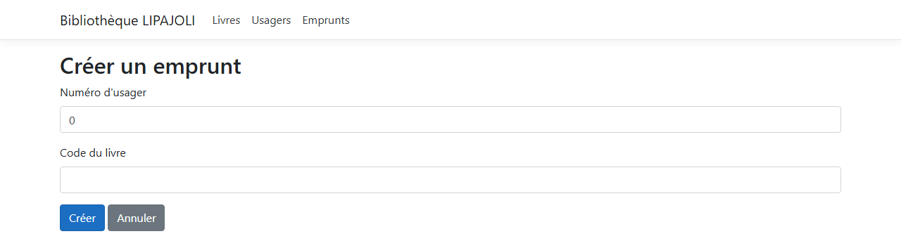
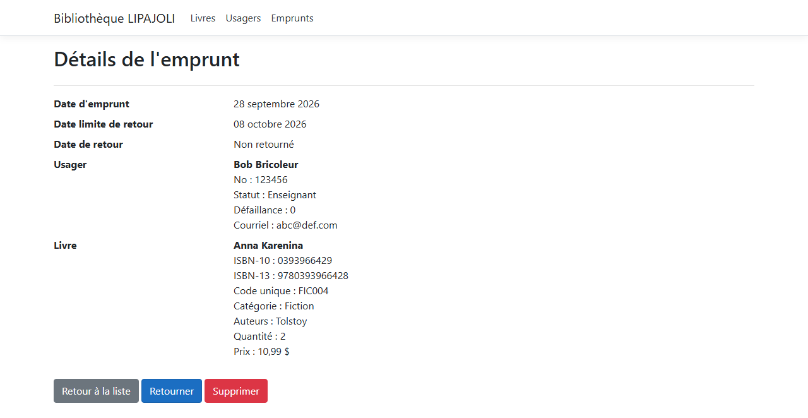
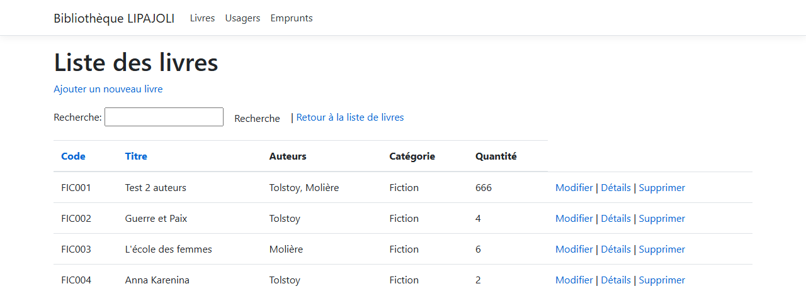
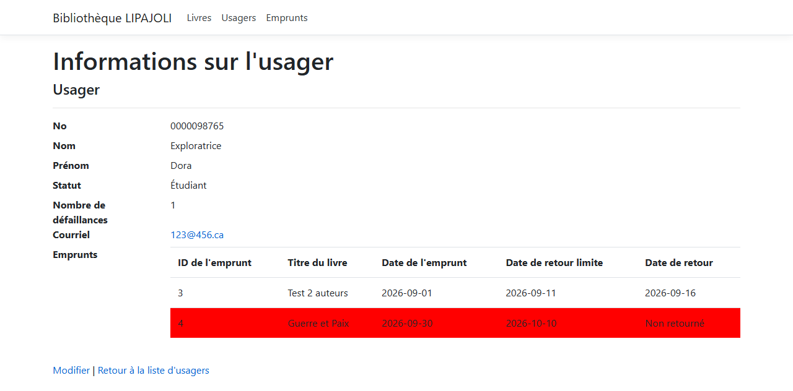
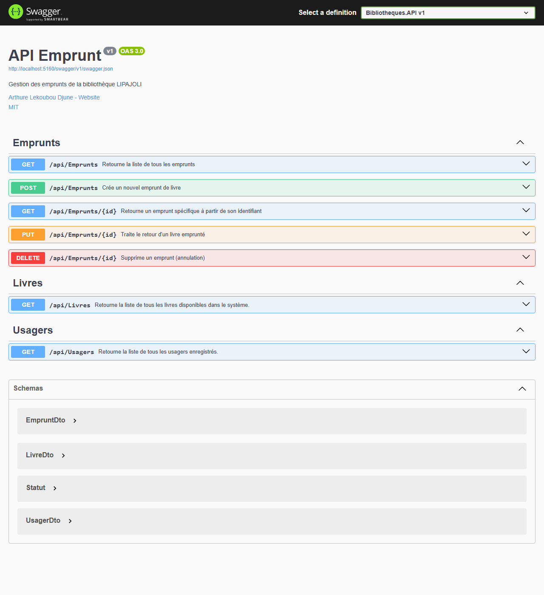

# lipajoli-library-loans

A library loans desk, in two applications. An **API** holds the rules and the data, in three layers. A **web application** holds the counter staff's screens and never touches the loan tables itself: it asks the API.

ASP.NET Core 8, Entity Framework Core 8, SQLite, Swagger. The site is in French.

## Screenshots

**The loans**


**Lending a book**



**A loan**



**The catalogue**



**A member file**



**The API**



## How it works

**A loan is refused before it is created, not after.** The copy has to be on the shelf, the member has to hold fewer than three books, and they cannot already be holding that same title. Each refusal comes back with its own sentence, on the form, with nothing written.

**The same book can be borrowed again once it is returned.** That sounds obvious, and it is exactly what a unique index on the member and the book forbade: a returned book could never be taken out again by the same person. The rule that was wanted is about holding two copies at once, and the service checks it.

**The due date is computed, never typed.** The loan length lives in the API configuration, and the form does not show it. Returning after that date adds a failure to the member's file by itself.

**Returned loans belong to the history.** They can be consulted, not deleted. Only a loan still in progress can be cancelled, and cancelling it puts the copy back on the shelf.

**The API answers with data, never with the object graph.** The entities point at each other, a loan to its member, a member back to their loans, and serialising that walks in circles. Three DTOs carry what the screens need and nothing more.

**A price is read the same way on both sides of the Atlantic.** 15,75 and 15.75 give the same number, and what cannot be decided is refused rather than guessed. Before that, neither of the two was accepted: the binder wanted a comma, the validation rule wanted a dot, so no price with cents could be recorded at all.

**Sixty-four tests, at three levels.** The controllers alone with their dependencies mocked, the generic repository and the loan service against a real SQLite database, one per test, and the whole API answering its own addresses from the incoming JSON to the outgoing one.

## Running it

The web application creates the SQLite file and fills it on its first run, so start it first.

```bash
cd BibliothequeLIPAJOLI
dotnet run
```

Then, in a second terminal, the API the application talks to:

```bash
cd Bibliotheques.API
dotnet run
```

The API listens on `http://localhost:5160`, which is the address the web application reads from its configuration, and its Swagger page is at `/swagger`. Delete `Bibliotheque_LIPAJOLI.db` to start over.

```bash
dotnet test Bibliotheques.API.sln
```

## Résumé

Comptoir d'emprunts de bibliothèque en ASP.NET Core 8, en deux applications. Une API en trois couches porte les règles et les données, avec un dépôt générique qui est le seul à parler à la base ; une application MVC porte les écrans et passe par l'API pour tout ce qui touche aux emprunts. Un prêt est refusé avant d'être créé si le livre est épuisé, si l'usager tient déjà trois livres ou s'il tient déjà celui-là, mais le même livre se réemprunte une fois rendu. La date limite se calcule à partir d'une durée lue dans la configuration, un retour en retard inscrit une défaillance au dossier tout seul, et un emprunt rendu appartient à l'historique : il ne se supprime plus. L'API répond par des DTO qui ne portent aucune propriété de navigation, ce qui arrête la sérialisation qui tournait en boucle. Soixante-quatre tests couvrent les trois niveaux, contrôleurs moqués, dépôt et service sur une vraie base SQLite, et l'API entière de bout en bout.

## Licence

MIT. See [LICENSE](LICENSE).
